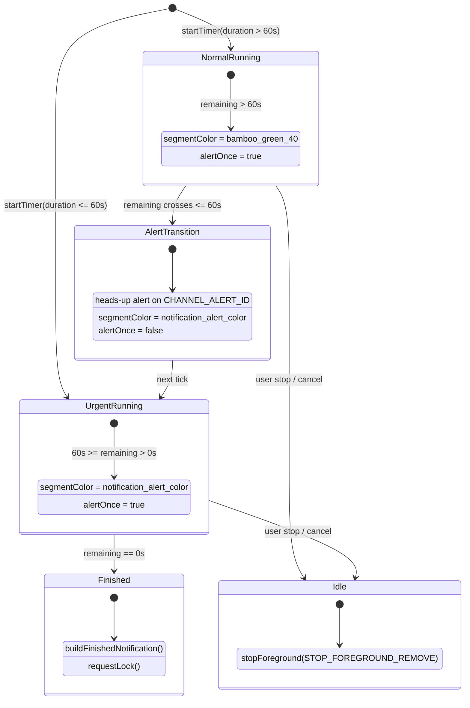

# Data Model & State Transitions: Live Update Chip 1-Minute Alert

**Feature**: `003-live-update-one-minute-alert`  
**Date**: 2026-09-30  

## Entities & Models

### 1. Chip Visual State (`NotificationUrgencyState`)
Represents the presentation parameters of the foreground service notification and Live Update chip during each countdown tick.

| Property | Type | Description |
| :--- | :--- | :--- |
| `remainingSeconds` | `Long` | Current seconds remaining on the countdown timer. |
| `totalSeconds` | `Long` | Total configured countdown duration in seconds. |
| `isUrgent` | `Boolean` | `true` if `remainingSeconds <= 60L`, indicating the 1-minute alert window. |
| `segmentColorRes` | `Int` | Resource ID of the segment color: `R.color.notification_alert_color` when `isUrgent` is `true`, `R.color.bamboo_green_40` when `false`. |
| `alertOnce` | `Boolean` | `false` only during the single transition tick where the heads-up alert is posted; `true` on all steady-state ticks to prevent continuous alert sounds. |

### 2. Color Theme Resources (`ColorTokens`)

| Token Name | File Path | Light Theme Value | Dark Theme Value | Contrast vs Background |
| :--- | :--- | :--- | :--- | :--- |
| `notification_alert_color` | `res/values/colors.xml` `res/values-night/colors.xml` | `#A05A00` | `#FFB03A` | $\ge 4.2:1$ (Light) $\ge 9.9:1$ (Dark) |
| `bamboo_green_40` | `res/values/colors.xml` | `#FF006D3D` | `#FF006D3D` | Standard Zen palette |

---

## State Transition Diagram

---

## Validation & Invariants

1. **State Invariance**: For any tick where `remainingSeconds <= 60L`, the `Notification.ProgressStyle.Segment` color must be resolved from `R.color.notification_alert_color`.
2. **Persistence**: The urgency color must never revert back to `bamboo_green_40` during a running countdown once the threshold is crossed.
3. **Accessibility**: In both light and dark theme configurations, `R.color.notification_alert_color` must satisfy the WCAG-AA 3:1 minimum contrast requirement for graphical UI objects.
4. **Boundary Exactness**: When a timer ticks from `61s -> 60s` or skips over `60s` directly to `59s`, `remainingSeconds <= 60L` transitions to `isUrgent = true`.
